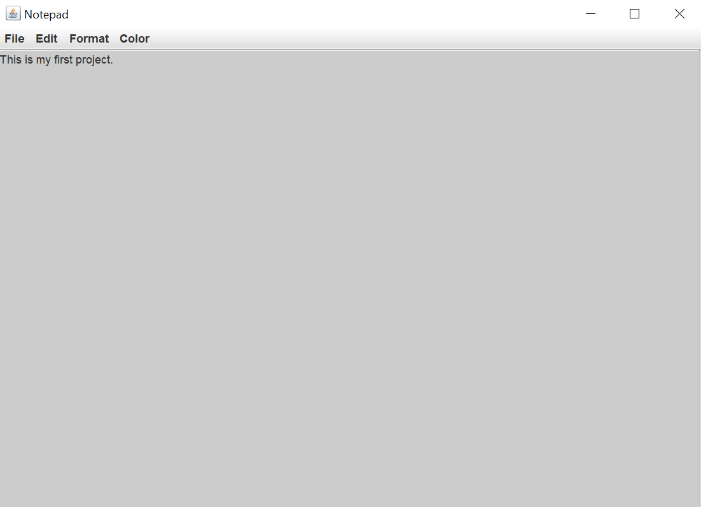

# NotepadProject

## Overview
A Java-based Notepad application with features like a stack-type clipboard, customizable font, and background color.

## Features
- **Stack Clipboard:** Keep multiple strings in the clipboard.
- **Java Swing GUI:** Graphical User Interface made using Java Swing.
- **Menu Bar with Options:**
  - **File Handling:**
    - New
    - Open
    - Save
    - Save As
    - Exit
  - **Editing Options:**
    - Cut
    - Copy
    - Paste
  - **Formatting Options:**
    - Font Size
    - Font Type
    - Word Wrap
  - **Background Color Change**
